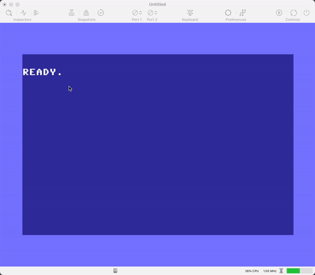

# Bölüm 04/06: Veri Tipleri

## Pointer Kavramı / Anlamı (Pointer Semantics)

[Değişkenler][01] konusunu işlerken;

> Nerede bir değişken kullanımı görürseniz mutlaka o değişkenin değerini yani
  **Value of**’unu kullandığınızı unutmayın!

demiştik. Biraz daha detaya girersek, go’da bir fonksiyona geçilen argüman /
parametre mutlaka kopyalanarak gönderiliyor;

```go
func foo(s string){ ... }

h := "hello" 
foo(h) // <- h’nin bir kopyası foo’ya gider.
```

Bu konunun terminolojideki adı **Pass by Value**’dür. Daha da iyi ispatlamak
için küçük bir örnek:

https://go.dev/play/p/ahKlWbzPsTU

```go
package main

import "fmt"

func increment(n int) {
	fmt.Println("increment", "gelen n", n, "memory adresi:", &n)
	// increment gelen n 10 memory adresi: 0x140000a4030

	n++

	fmt.Println("increment", "arttıktan sonra n", n)
	// increment arttıktan sonra n 11
}

func main() {
	num := 10
	fmt.Println("num:", num, "memory adresi:", &num)
	// num: 10 memory adresi: 0x1400011a020

	increment(num) // num'ın kopyası gönderilir
	fmt.Println("num:", num, "memory adresi:", &num)
	// num: 10 memory adresi: 0x1400011a020
}
```

`increment` fonksiyonuna `num`’ı yolladık, içeride değerin, `1` arttırdık ama
`num` değişmedi, çünkü `num`’ın kendisi değil değeri gönderildi fonksiyona.
Zaten `increment` fonksiyonu içindeki `n`’in hafızafaki yeri `0x140000a4030`,
bizim parametre olarak gönderdiğimizinki `0x1400011a020` eşit değiller.

Peki, gerçekten `num`’ın değerini değiştirmek zorunda olsak? Fonksiyona
`num`’ın değeri yerine hafızada durduğu adresi yollasak? fonksiyon direk
hafızadaki değeri okusa, arttırsa ve geri yerine yerleştirse?

https://go.dev/play/p/axJq-pjSBza

```go
package main

import "fmt"

func increment(n *int) {
	fmt.Println("increment", "gelen n", *n, "memory adresi:", n)
	// increment gelen n 10 memory adresi: 0x1400009c010

	*n++ // * ile dereferencing yani adresin içinde değeri al
    
    /*
	num := *n // hafızdan değeri al, ata
	num++     // bir arttır
	*n = num  // hafızada değerin durduğu yerin için num'ı yerleştir
    */

	fmt.Println("increment", "arttıktan sonra n", *n)
	// increment arttıktan sonra n 11
}

func main() {
	num := 10
	fmt.Println("num:", num, "memory adresi:", &num)
	// num: 10 memory adresi: 0x1400009c010

	increment(&num) // num'ın hafızadaki yeri (adresi) gönderilir
	fmt.Println("num:", num, "memory adresi:", &num)
	// num: 11 memory adresi: 0x1400009c010
}
```

Peki `pointer` (işaretçi demek istiyorum ama identifier ile karışmasın diye
pointer’la devam ediyorum) ne işimize yarayacak? Artıları ve eksileri ne?

En dikkat edilmesi gereken konu **defererencing**. Çünkü pointer kabul eden
bir fonksiyona argüman olarak `nil` gönderebiliriz. Eğer pointer beklediğimiz
durumda "acaba gelen değer gerçekten bir adresi işaret ediyor mu?" diye
bakmazsak uygulamamız hata verir:

    invalid memory address or nil pointer dereference

Hatta örnekteki fonksiyonu bakın nasıl patlatıyoruz:

https://go.dev/play/p/q8zupdpeVBb

```go
package main

import "fmt"

func increment(n *int) {
	fmt.Println("increment", "gelen n", *n, "memory adresi:", n)

	*n++ // * ile dereferencing yani adresin içinde değeri al

	fmt.Println("increment", "arttıktan sonra n", *n)
}

func main() {
	num := 10
	fmt.Println("num:", num, "memory adresi:", &num)

	increment(nil)
}

// num: 10 memory adresi: 0x1400011a020
// panic: runtime error: invalid memory address or nil pointer dereference
// [signal SIGSEGV: segmentation violation code=0x2 addr=0x0 pc=0x10288fc00]
//
// goroutine 1 [running]:
// main.increment(0x0)
// 	untitled:6 +0x60
// main.main()
// 	untitled:17 +0xcc
// exit status 2
```

Peki ne yapmamız lazımdı?

https://go.dev/play/p/z_S8aPmdBlB

```go
package main

import (
	"fmt"
	"log"
)

func increment(n *int) error {
	if n == nil {
		return fmt.Errorf("n nil geldi")
	}
	fmt.Println("increment", "gelen n", *n, "memory adresi:", n)

	*n++ // * ile dereferencing yani adresin içinde değeri al

	fmt.Println("increment", "arttıktan sonra n", *n)
	return nil
}

func main() {
	num := 10
	fmt.Println("num:", num, "memory adresi:", &num)

	if err := increment(nil); err != nil {
		log.Fatal(err)
	}
}
// num: 10 memory adresi: 0x1400001a100
// 2023/08/06 10:43:18 n nil geldi
// exit status 1
```

> Eğer gelen değer pointer’sa ve dereferencing yapacaksak mutlaka `nil` kontrolü
  yapmamız lazım

Peki nerelerde bu **pointer** kullanımı yaparız? Elimizde büyük veriler varsa ve
bunu bir fonksiyona geçmemiz gerekiyorsa, o kocaman veriyi fonksiyona geçmek
yerine verinin hafızadaki adresini pas ediyoruz. Neticede o veri hafızada bir
yere yerleşti. Veritabanından gelen sorguda 500 kayıt dönüyor, her kayıt 10
kilobyte olsa yaklaşık 5 Megabyte veri var hafızada. Bunu **pass by value**
olarak yollarsak bir 5 Megabyte daha harcamak yerine, hafızadaki adresini
veriyoruz.

[JSON][02] konusunda da kullanım şekillerini göreceğiz. Unutmayalım;

- Eğer hafızadaki veriyi paylaşacaksak (database örneğindeki gibi) kullanalım
- Opsiyonel argüman (eğer nil gelirse pas geç) almak gerekirse kullanalım
- `*` operatörü ile adresin içindeki değeri alırız
- Değişkeni bir kutu gibi düşünüp, kutunun içindeki şey **value of**, kutunun
  durduğu yer de **address of**

Pointer konusu taaaa 1984’deki **Commodore 64**’te bile var. Commodore 64’ün
metin ekran hafıza adresi `$0400`’den başlıyor. Bunu `&memory` gibi düşünün,
değeri hafıza adresi. `$0400`’ün içinde bulunan value’ları monitör programı
yardımıyla değiştiriyoruz yani `*memory = ` gibi...



[01]: https://github.com/vbyazilim/maoyyk2023-golang-101-kursu/tree/main/docs/03/03-degiskenler.md
[02]: https://github.com/vbyazilim/maoyyk2023-golang-101-kursu/tree/main/docs/13/01-json-ile-calismak.md