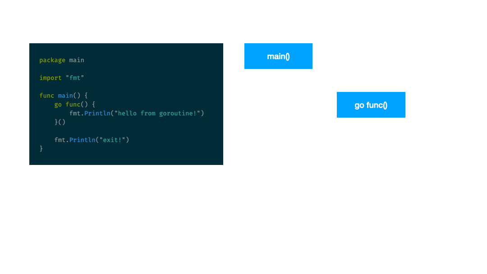

# Bölüm 15/01: Concurrency

Türkçe kelime anlamı olarak **eşzamanlılık** olan concurrency, go açısından;

> Allows part of the program to execute independently

yani; **programın bir bölümünün bağımsız olarak çalışmasına izin verir**
şeklindedir. **Herhangi bir sıra olmadan**, **eş zamanlı** olarak programın
belli kısımları çalışır.

**Rob Pike**’ın efsane proverb’lerinden hatırlayalım;

> Concurrency is not parallelism.

**Parallelism** yani paralel olarak çalışma, programın bazı bölümlerinin
bağımsız olarak, **aynı anda** çalışması demektir. Oysa, **concurrency**’de
**bağımsız ve sırasız** olarak çalışan küçük küçük parçacıklar olur.

Paralel çalışma sadece **multi-core** işlemcilerde mümkünken, concurrent
çalışma için single-core’lu bir işlemci yeterlidir. Dolayısıyla, concurrent
çalışan kod **bağımsız**, paralel çalışan kod ise **simültane** yani aynı anda
çalışan şeklindedir.

Go, **CSP** yani **C**ommunicating **S**equential **P**rocesses denilen,
temeli 1979’lara dayanan bir strateji kullanır. CSP’nin atası 1934 doğumlu
İngiliz bilgisayar bilimci [Tony Hoare][01]’dur.

Hatta `C`’den `golang`’e geçen pek çok programcı, 
**asenkron gibi çalışan kodu lineer olarak yazabiliyoruz!** der :)

Bu teknikle go, process zamanlama işlerini, işletim sistemine **bırakmadan**
kendisi organize ediyor. Kendi içinde **Local Run Queue** adında bir kuyruk
tutuyor ve concurrent işleri bu kuyruk sayesinde organize ediyor. Bu sayede
tek bir thread go için yeterli oluyor!

Bu concurrent çalışma işlerini **goroutine**’lerle yapıyoruz. Dolayısıyla
goroutine’lerin senkronizasyonu ve orkestrasyonu bizim elimizde. Yani bunu
kodu yazan kişi olarak bir yapacağız!

---

## Goroutine

Bir fonksiyonu çağırırken başına `go` anahtar kelimesi koyduğumuz an artık o
bir **goroutine** haline dönüşmüş olur. Aslında **go runtime** tarafından
yönetilen **hafif siklet** process’lerdir goroutine’ler.

O kadar az maliyetlidir ki, yüzlerce, binlerce goroutine tetikleyebiliriz.
Klasik **thread** oluşturmaktan kat be kat hızlıdır çünkü olaylar işletim
seviyesindeki kaynaklarda değil, go’nun kendi içinde yönettiği kaynak ve
kuyruklarla işlenir.

Stack size’ı thread’in stack size’ndan çok küçüktür ve gerektiği zaman
genişleyebilir. Default’u **8 KB**’dır. Thread is **1 MB**’dan büyük olup,
**1000** thread neredeyse **1 GB** hafıza tüketirken, **1000** goroutine 
**8MB** hafıza tüketir.

https://go.dev/doc/go1.2#stack_size

    In Go 1.2, the minimum size of the stack when a goroutine is created has
    been lifted from 4KB to 8KB. Many programs were suffering performance
    problems with the old size, which had a tendency to introduce expensive
    stack-segment switching in performance-critical sections. The new number
    was determined by empirical testing.

    At the other end, the new function SetMaxStack in the runtime/debug
    package controls the maximum size of a single goroutine's stack. The
    default is 1GB on 64-bit systems and 250MB on 32-bit systems. Before Go
    1.2, it was too easy for a runaway recursion to consume all the memory on
    a machine.

    Updating: The increased minimum stack size may cause programs with many
    goroutines to use more memory. There is no workaround, but plans for
    future releases include new stack management technology that should
    address the problem better.

Goroutine’ler arasında geçiş yapmak, thread’ler arasında geçiş yapmaktan daha
hızlıdır. Bu yüzden yüzlerce, binlerce goroutine çalıştırmak mümkündür!

Go scheduler (zamanlayıcı) açısından, goroutine’lerin 3 tane state’i vardır;

1. running
1. runnable
1. waiting

Şimdi örneğe bakalım:

https://go.dev/play/p/46eWKM78bvx

```go
package main

import "fmt"

func main() {
	func() {
		fmt.Println("hello from goroutine!")
	}()

	fmt.Println("exit!")
}

// hello from goroutine!
// exit!
```

## `go` Anahtar Kelimesi

Bu kod çalıştığı zaman, önce anonim fonksiyon çalışır, sonra da `fmt.Println`
çalışır ve işlem biter. Peki biz anonim fonksiyon başına `go` eklersek ne olur?

https://go.dev/play/p/2yDwJseRCov

```go
package main

import "fmt"

func main() {
	go func() {
		fmt.Println("hello from goroutine!")
	}()

	fmt.Println("exit!")
}

// exit!
```

`go` kelimesini göre go derleyicisi, olayı şöyle yorumlar; ben bu fonksiyonu
çağıracağım ama işini bitirmesini beklemeyeceğim. Yüzme havuzu gibi düşünün,
`main` fonksiyonuna girildiğinde tek bir kulvar var, `go` devreye girince
içindeki fonksiyon diğer kulvarda çalışıyor ve `main` o kulvarın işini
bitirmesini beklemeden işini bitirip çıkıyor.

Go runtime bize sadece şunu garanti ediyor: goroutine, gelecekte bir zamanda
kesin çalışacak! Ama ne zaman bilmiyoruz :)



`main()` fonksiyonu `go func(){...}()` fonksiyonundan önce bitti ve
uygulamadan çıktı. Aslında `go func(){...}()` çalıştı ama `main()` o kadar
hızlı oldu ki... Hatta burada **memory leak** bile oluştu!

Peki, `main` biraz beklese?

https://play.golang.org/p/zUUkudUt-0m

```go
package main

import (
	"fmt"
	"time"
)

func main() {
	go func() {
		fmt.Println("hello from goroutine!")
	}()

	time.Sleep(2 * time.Second)   // <- bekleme için 2 saniye, garantili...
	fmt.Println("exit!")
}

// hello from goroutine!
// exit!
```

Şimdi ne oldu? `main()` bloke oldu, bu esnada ayrı telden çalan goroutine
işini bitirdi. Sırf goroutine’inin çalışmasını görmek için mecburen
`time.Sleep` ile aslında **kötü bir kod** yazdık. Hatta asla böyle bir kodu gerçek
hayatta **kullanmamamız** lazım!

Peki nasıl daha iyi hale gelebilirdi? Ne yapmak lazım? Goroutine’nin işini
bitirmesini bekleyecek bir yöntem olmalı?

---

## WaitGroup

`sync` paketi içindeki `WaitGroup` ile bu kodu şu şekilde düzeltebiliriz:

https://go.dev/play/p/jz75LNOdtRX

```go
package main

import (
	"fmt"
	"sync"
)

func main() {
	var wg sync.WaitGroup

	wg.Add(1) // add 1 to goroutine counter

	// only one goroutine is this (except the main function)
	go func() {
		fmt.Println("hello from goroutine!")
		wg.Done() // subtract 1 from goroutine counter
	}()

	wg.Wait() // wait till the counter hits zero!
	fmt.Println("exit!")
}

// hello from goroutine!
// exit!
```

Ne yaptık?

1. Kaç tane goroutine varsa `.Add()` ile ekledik
1. Goroutine içinde `.Done()` ile counter’ı eksilttik
1. `Wait()` ile counter sıfıra gelene kadar bekledik. Sıfır olunca
goroutine’ler işini bitirmiş oluyor

Eğer `wg.Done()`’ı yazmazsak; **Deadlock** oluşur! `wg.Wait()` boşuna bekler
ve counter sıfıra inmez...

```bash
fatal error: all goroutines are asleep - deadlock!

goroutine 1 [semacquire]:
sync.runtime_Semacquire(0x1400001c0b4)
	/opt/homebrew/Cellar/go/1.17.2/libexec/src/runtime/sema.go:56 +0x38
sync.(*WaitGroup).Wait(0x1400001c0b4)
	/opt/homebrew/Cellar/go/1.17.2/libexec/src/sync/waitgroup.go:130 +0xa4
main.main()
	/Users/vigo/Desktop/demo.go:17 +0x64
exit status 2
hello from goroutine!
```

Bu yaklaşım, eğer goroutine’lerden geriye bir şey **dönmesini istemiyorsak**
kullanacağımız bir yaklaşımdır. Örneğin bir `slice` içince `N` tane websitesi
adresi olsun. Bu sitelerin ayakta olup olmadıklarını kontrol etmek istiyoruz
ve `slice`’ın sayısı kadar goroutine ateşliyoruz:

https://go.dev/play/p/6naaL-Tm6WJ

[Örnek](https://github.com/vbyazilim/maoyyk2023-golang-101-kursu/tree/main/src/15/waitgroup)

```go
package main

import (
	"fmt"
	"net/http"
	"sync"
)

func main() {
	var wg sync.WaitGroup

	urls := []string{
		"https://httpbin.org/delay/2",
		"https://kamp.linux.org.tr/2023-yaz/",
		"https://github.com/",
		"https://ugur.ozyilmazel.com/",
		"https://vigo.io",
		"https://fooo-fake-nonurl-xxxxxxxxx.com.tr",
	}

	wg.Add(len(urls))

	for _, url := range urls {
		// wg.Add(1) // <-- bu şekilde de olabilirdi...
		go func(url string) {
			res, err := http.Get(url) // nolint
			if err == nil {
				fmt.Println(url, res.Status)
			} else {
				fmt.Println(url, err)
			}

			wg.Done()
		}(url) // <- dışarıdaki url’i goroutine’ne geçiyoruz! yani her goroutine’e doğru değer!
	}

	wg.Wait()
}

// https://fooo-fake-nonurl-xxxxxxxxx.com.tr Get "https://fooo-fake-nonurl-xxxxxxxxx.com.tr": dial tcp: lookup fooo-fake-nonurl-xxxxxxxxx.com.tr: no such host
// https://vigo.io 200 OK
// https://ugur.ozyilmazel.com/ 200 OK
// https://github.com/ 200 OK
// https://kamp.linux.org.tr/2023-yaz/ 523
// https://httpbin.org/delay/2 200 OK
```

Dikkat ettiyseniz, `wg` için **closes over** yani bulunduğu scope içinde ilave
bir iş yapmadık ama loop içindeki goroutine’i `go func(url string){...}(url)` 
şeklinde geçtik. Eğer bu şekilde yapmasaydık;

```go
for _, url := range urls {
	go func() {
		fmt.Println("url", url)  // <-- bu her zaman aynı değer
		wg.Done()
	}()
}
```

**loop variable url captured by function literal**

durumu olup, goroutine içinde `url` diye almaya çalıştığımız şey yanlış
olacaktı! Bazen son eleman bazen de random bi eleman olacaktı. Neden? çünki
`url`’in değeri goroutine çalışmadan önce değişecekti ve goroutine bundan
haberdar olmayacaktı! Tüm goroutine’ler aynı değişkeni paylaşacaktı!

**Nasıl durduracağını (stop) bilmiyorsan o goroutine’i başlatma!**

---

[01]: https://en.wikipedia.org/wiki/Tony_Hoare