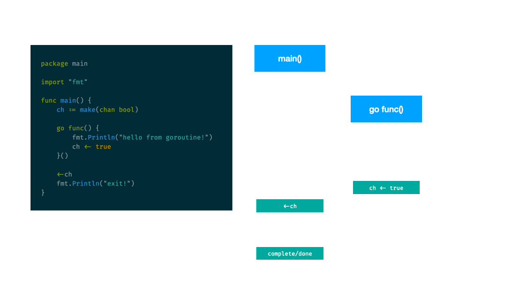

# Bölüm 15/02: Concurrency

## Channels

`chan` (channel) go’da goroutine’ler arasında veri taşımaya yarayan ön-tanımlı
(built-in) bir tiptir. Yani `int` gibi `map` gibi bir tiptir. Bir goroutine
channel’a veri yazarken, başka bir goroutine o channel’ı dinleyip okuyabilir.

Asıl amaç channel’ların goroutine’ler arasında paylaşılabilmesidir. Hatta
sevgili Rob Pike’ın o efsane sözlerinden biri olan;

> Don't communicate by sharing memory, share memory by communicating

hatırlatmak isterim; **hafızayı paylaşarak** iletişim kurmayın, 
**iletişim kurarak** hafızayı paylaşın! Yani channel’ları kullanın! diyor...

Normal şartlarda fonksiyon geriye değer dönebilir ama `go` anahtar kelimesiyle
tetiklenen fonksiyonların dönüşünü `main` beklemediği için, goroutine ile
çalışan fonksiyon ile `main` arasındaki iletişim channel’lar üzerinden
sağlanır.

- Birden fazla goroutine aynı channel’a yazabilir
- Birden fazla goroutine aynı channel’dan okuyabilir

Tabi tüm bunlar sizin uygulamak istediğiniz concurrency pattern’ine bağlı
olarak değişen şeylerdir.

- Channel’daki veri mutlaka bir tipte olmalı, yani `make(chan)` ile channel
  oluşturulmalı, aynı `map`’deki gibi...
- Default olarak channel read/write (okuma/yazma) senkron işlemlerdir
- Channel’a bir değer atamak, aynı fonksiyona parametre geçmek gibidir
- Channel’a reference types (pointer, map, slice vs...) geçerken dikkatli olmak
  gerekir. Çünkü DATA RACE olması yüksek ihtimaldir. Yani bir goroutine değer okurken,
  diğer bir goroutine’de yeni değer atamaya çalışırsa durum race-condition durumu olur.

Bir goroutine, channel’a yazdığı zaman, diğer bir goroutine o channel’dan
okuyana kadar pause / block olur. Yani goroutine channel’dan okumak istedi ve
okuyacağı bir değer (value) yoksa, değer gelene kadar o goroutine beklemeye
devam eder...

Aslında bu aynı linux/unix pipe’lara benzer:

```bash
$ cat foo | grep 'bar' | cut -d'.' -F1
#               |           |
#               ↓           |
#          cat’i bekler     |      
#                           ↓
#                         grep’i bekler 
```

Channel’ı kapatmak, sizin artık o channel ile işinizin kalmadığı anlamına
gelir.

4 Tür channel var;

1. Unbuffered
1. Buffered
1. Closed
1. Nil

3 Tür channel state var;

1. **nil** -> zero-value
1. **open** -> `make(...)`
1. **close** -> `close(...)`

**State’ine göre send/receive uygunluğu**

|         | example      | nil     | open    | closed  |
|:--------|:-------------|:--------|:--------|:--------|
| send    | `ch <- true` | blocked | allowed | panic!  |
| receive | `<-ch`       | blocked | allowed | allowed |

**Garantileme durumuna göre**

|           | Garanti    | Garanti Yok   | Gecikmeli Garanti |
|:----------|:-----------|:--------------|:------------------|
| `channel` | Unbuffered | Buffered `ch > 1` | Buffered `ch = 1` |

Normalde channel’ı fonksiyona geçerken **bi-directional** yani hem **send**
hem de **receive** edebilir şekilde geçiyoruz;

```go
func Foo(ch chan int){}
```

Bunu limitlemek mümkün. Yani duruma göre **receive-only** ya da **send-only**
yapmak da mümkün;

```go
func receiveOnly(ch <-chan int) {
	fmt.Println("read/receive", <-ch)
}

func sendOnly(ch chan<- int) {
	ch <- 1
}
```

[Örnek](https://github.com/vbyazilim/maoyyk2023-golang-101-kursu/tree/main/src/15/channels/send-only)

```bash
$ go run src/15/channels/send-only/main.go
```

kod:

```go
package main

import (
	"fmt"
)

func returnReceiveOnly() <-chan int {
	c := make(chan int)

	go func() {
		defer close(c)

		// bu fonksiyondan dönen channel'ı receive
		// eden her kimse, en fazla 100 tane sayı
		// receive edebilir.

		// loop bitiminde defer ile channel kapandığı
		// için, 100+ zero-value => 0 gelir...
		for i := 0; i < 100; i++ {
			c <- i
		}
	}()

	return c
}

func main() {
	r := returnReceiveOnly() // returns receive-only channel

	// r <- 10 // invalid operation: cannot send to receive-only type <-chan int

	for i := 0; i < 200; i++ {
		fmt.Println(<-r)
	}
}

// read/write-only channels are distinct types, the compiler can use its existing
// type-checking mechanisms to ensure the caller does not try to write stuff
// into a channel it has no business writing to.
```

Bi-directional channel ile teknik/performans farkı yok sadece compile-time’da;
**receive only** kullanmak istediğiniz channel’a send etmek isterseniz;

```bash
invalid operation: cannot send to receive-only type <-chan int
```

gibi hata vererek kodu düzeltmenizi ister. Şimdi ilk yaptığımız, hani
`time.Sleep` kullanarak yaptığımız örneği **channel** kullanarak yapalım;

[Örnek](https://github.com/vbyazilim/maoyyk2023-golang-101-kursu/tree/main/src/15/channels/basic-goroutine-with-channel)

https://go.dev/play/p/E8EzcHasNxE

```bash
$ go run src/15/channels/basic-goroutine-with-channel/main.go
```

kod:

```go
package main

import (
	"fmt"
)

func main() {
	ch := make(chan bool) // channel holds bool type!

	go func() {
		fmt.Println("hello from goroutine!")
		ch <- true // writing to ch channel
	}()

	<-ch // channel'dan veri gelene kadar blok!, reading from ch channel
	fmt.Println("exit!")
}

// hello from goroutine!
// exit!
```



---

## Unbuffered Channels

Aslında şu ana kadar yaptığımız örnekler unbuffered channels örnekleriydi.
Yani channel, tampon olmaksızın, ayni unix/linux’daki pipe mantığıyla
al-gülüm-ver-gülüm şeklinde **senkron** şekilde çalıştı. Yani alma-verme işi
senkron, aynı anda oldu. Bu kesin garantili bir yöntem.

Channel’a gönderme (send) ve channel’dan okuma (receive) aynı anda oldu. Yani
almak için birinin göndermesi lazım. Aksi halde **blocking** işlem oluyor. Bu
durum **unknown latency** yani bilinmeyen bir gecikmeye sebep olur.

Şöyle düşünün; `curl <URL> | grep 'foo'` eğer indirmek istediğiniz dosya çok
büyükse, (gigabyte’lar seviyesi) `grep` `curl`’ü download hızınız kadar
beklemek zorunda.

Garanti şu anlamdadır: receive (yani channel’dan alma), send’den (yani
channel’a gönderme) nano saniye kadar önce olur.

https://www.youtube.com/watch?v=LvgVSSpwND8

## `done` Pattern

[Örnek](https://github.com/vbyazilim/maoyyk2023-golang-101-kursu/tree/main/src/15/channels/done-pattern)

https://go.dev/play/p/kHzc8P2kcji

```bash
$ go run src/15/channels/done-pattern/main.go
```

kod:

```go
package main

import (
	"crypto/rand"
	"fmt"
	"math/big"
)

func main() {
	amount := 10

	fmt.Println("channel'a", amount, "adet sayı yollayacağız")

	ch := make(chan int)
	done := make(chan struct{})

	// channel'a gönder (send)
	go func() {
		for i := 0; i < amount; i++ {
			randomInt, _ := rand.Int(rand.Reader, big.NewInt(100))
			ch <- int(randomInt.Int64()) + 1 // randon sayı 0-100 araası
		}
	}()

	// channel'dan al (receive)
	go func() {
		fmt.Println()
		for i := 0; i < amount; i++ {
			fmt.Println("gelen (received) sayı", <-ch)
		}
		fmt.Println()
		close(ch)

		close(done) // channel'ı kapat ya da
		// done <- struct{}{} // done için kullanılan channel'a boş struct koy, channel'a veri gitti
	}()

	<-done // veri gelene kadar blokla...

	fmt.Println("bitti...")
}
```

---

## Deadlock

Channel’a yazan olmazsa, okumak isteyen havada kalır, boşu boşuna bekler. Bu
durumda goroutine’ler uykuya dalar...

**fatal error: all goroutines are asleep - deadlock!**

[Örnek](https://github.com/vbyazilim/maoyyk2023-golang-101-kursu/tree/main/src/15/channels/done-pattern)

https://go.dev/play/p/U4ulhb8DtVC

```bash
$ go run src/15/channels/deadlock/main.go
```

kod:

```go
package main

import (
	"fmt"
	"time"
)

func main() {
	ch := make(chan int)

	go count(ch)

	// sonsuz döngüde ch channel'ından receive yapıyoruz..
	for {
		fmt.Println(<-ch)
	}
}

func count(ch chan int) {
	for i := 0; i < 5; i++ {
		ch <- i
		time.Sleep(time.Millisecond * 500) // yarım saniye bekletme, görmek içim
	}
    // loop bitti ama yukarıdaki for{} halen okumak istiyor
}

// 0
// 1
// 2
// 3
// 4
// fatal error: all goroutines are asleep - deadlock!
//
// goroutine 1 [chan receive]:
// main.main()
// 	.../src/15/channels/deadlock/main.go:15 +0x7c
// exit status 2
```

Neden **deadlock** oluştu? `count` fonksiyonundaki loop tamamlandı, fonksiyon
işini bitirip çıktı ama biz halen channel’a data gelmesini bekliyoruz `main()`
içindeki `for{}`’da.

Artık o channel’a gönderme (send) yapacak aktif bir **goroutine** yok. Bu
bakımdan `main()` sonsuza kadar bekleyecek ve asla **terminate** olamayacak.
Bu bakımdan go **deadlock** oluşturarak programı durdurdu!

Bu problem **run-time**’da tespit edildi. Yani go bunu **compile-time**’da
değil run-time’da algılayabiliyor. Algılayabilse zaten uyarı verirdi :) Bu
bakımdan kod derlemesi başarılı olsa bile, çalışırken bu tür kötü sürprizler
olabilir.

Bu durum oluştuğu an artık goroutine’ler bir iş yapamıyor, uykuya geçiyor.
Çözüm ne? İş bitiminde kanalı kapatmak.

### UNUTMAYIN! ALTIN KURAL

Eğer siz receiver’sanız (yani kanaldan okuyansanız `<-ch`) asla channel’ı
kapatmayın, sadece sender (`ch <- true`) channel’ı kapatmalıdır!

Kanalı kapatacak olan işin bittiğinden emin olan olmalıdır. Sender olan `count()`
fonksiyonu, loop’un bittiği anı o biliyor. Kapatacak olan da o!

Channel’a yazan (sender) her zaman kaç tane goroutine olduğunu bilir ama
okuyan (receiver) bunu bilemez. `close` den **her zaman yazan (sender)** olmalıdır!

Aynı örnekte ufak bir değişiklik yapalım:

[Örnek](https://github.com/vbyazilim/maoyyk2023-golang-101-kursu/tree/main/src/15/channels/open-close-check)

https://go.dev/play/p/czqEVQxGg7J

```bash
$ go run src/15/channels/open-close-check/main.go
```

kod:

```go
package main

import (
	"fmt"
	"time"
)

func main() {
	ch := make(chan int)

	go count(ch)

	// sonsuz döngüde ch channel'ından receive yapıyoruz..
	for {
		// channel'dan genel golang convention'ındaki gibi
		// value, ok := şeklinde
		// ch'daki değer ve channel'ın açık/kapalı olma bilgisini alıyoruz
		msg, open := <-ch
		if !open {
			break // eğer kapalıysa döngüden çık, main artık exit etsin, iş bitsin
		}

		fmt.Println(msg)
	}
}

func count(ch chan int) {
	for i := 0; i < 5; i++ {
		ch <- i
		time.Sleep(time.Millisecond * 500) // yarım saniye bekletme, görmek içim
	}
	close(ch)
}
```

`value, ok` yaklaşımı ile go bize, eğer channel açıksa (closed değilse)
channel’ın değerini döner. `if !open {break}` yani channel kapandıysa loop’a
devam etmeye gerek yok.

Keza **send** işlemi de bloklar;

```go
package main

import (
	"fmt"
)

func main() {
	ch := make(chan string)
	ch <- "hello world" // burada bloklar, aynı anda birinin bunu okuması lazım.

	fmt.Println(<-ch)
}

// fatal error: all goroutines are asleep - deadlock!
```

Çözüm:

https://go.dev/play/p/aZWYNsf7KnW

[Örnek](https://github.com/vbyazilim/maoyyk2023-golang-101-kursu/tree/main/src/15/unblock-send)

```bash
$ go run src/15/channels/unblock-send/main.go
```

kod:

```go
package main

import (
	"fmt"
)

func main() {
	ch := make(chan string)
	done := make(chan struct{})

	// bu kısım main'den farklı bir kulvarda çalışmaya başladı
	go func() {
		fmt.Println(<-ch) // gönder gelsin
		done <- struct{}{}
	}()

	ch <- "hello world" // gönderdim
	<-done

	fmt.Println("bitti")
}
```

Ya da **buffered channels** kullanmak

---

## Range Over Channels

Aynı örneği **syntactic sugar** kullanarak yani, zahmetsiz open/close kontrolü
ve yeteri sayıda iterasyonla channel’ı tüketebiliriz:

[Örnek](https://github.com/vbyazilim/maoyyk2023-golang-101-kursu/tree/main/src/15/channels/range-over-channels)

https://play.golang.org/p/qTwbWZpTSmi

```bash
$ go run src/15/channels/range-over-channels/main.go
```

kod:

```go
package main

import (
	"fmt"
	"time"
)

func main() {
	ch := make(chan int)

	go count(ch)

	// ch channel'ı kapanana kadar içinde iterasyon yapıyoruz
	// bu yöntemle kanal açık mı? kapalı mı? bakmaya gerek kalmıyor...
	// bu bir syntactic sugar
	for msg := range ch {
		fmt.Println(msg)
	}
}

func count(ch chan int) {
	for i := 0; i < 5; i++ {
		ch <- i
		time.Sleep(time.Millisecond * 500) // yarım saniye bekletme, görmek içim
	}
	close(ch)
}
```

---

## Buffered Channels

Send / receive işleminin asenkron yani birbirlerini beklememeleri için
buffered yani tamponlu channels kullanırız. Bufferın boş olma ya da dolu olma
durumuna göre diğer unbuffered channels’a göre bloklama işlemi farklı çalışır.

Aslında bir tür sender ve receiver arasına **buffer** ekliyoruz:

[Örnek](https://github.com/vbyazilim/maoyyk2023-golang-101-kursu/tree/main/src/15/channels/unblock-send-with-buffered-ch)

https://go.dev/play/p/WRH9PNXlEoK

```bash
$ go run src/15/channels/unblock-send-with-buffered-ch/main.go
```

kod:

```go
package main

import (
	"fmt"
)

func main() {
	ch := make(chan string, 1) // aynı slice capacity gibi, kapasitesi 1 olan channel
	ch <- "hello world"        // gönder, bloklama yok
	fmt.Println(<-ch)          // anında görüntü

	fmt.Println("bitti")
}
```

Eğer `capacity > 1` ise, send/receive garantisi yoktur. Send, receive’den önce
olur. Aslında belirsiz gecikme süresini düşürmek amacıyla kullanılmalıdır.
Buffer küçük olmalı yani **sadece işi yapabilecek kadar** channel kapasitesi
olan bir buffer yapılmalıdır.

Buffer dolduktan sonra o channel’dan okuma yapabiliriz. Buffer **dolana
kadar** bloklama olur. Buffer **sonsuz değildir**! Buffer **dolunca** başka
bir goroutine gidip buffer’dakileri okumalıdır.

Eğer `capacity = 1` ise, bu **gecikmeli garanti** yani, send, receive’i
garanti edebilir. Receive, send’den önce olur. Sender, **buffer dolana kadar**
blok olmadan gönderir. Buffer dolunca block olur. Receiver, buffer boşalana
kadar blok olmadan receive eder, buffer boşalınca blok olur.

Buffered channel’lar in-memory **FIFO** queue yani, ilk gönderilen (send) ilk
alınan (receive) şeklinde çalışır.

[Örnek](https://github.com/vbyazilim/maoyyk2023-golang-101-kursu/tree/main/src/15/channels/buffered-channels)

https://go.dev/play/p/FrBCaAwfg_l

```bash
$ go run src/15/channels/buffered-channels/main.go
```

kod:

```go
// nolint:dupword
package main

import "fmt"

func main() {
	ch := make(chan int, 4)     // Kapasitesi 4 olan buffered bir channel
	done := make(chan struct{}) // sinyalizasyon için kullanılacak bir channel, buna done channel pattern denir

	// goroutine ateşliyoruz...
	go func() {
		ch <- 1
		ch <- 2
		ch <- 3
		ch <- 4
		// ch <- 5 // bloklar!
		close(ch) // channel'ı kapat, artık yazılamaz
	}()

	go func() {
		// buffered channel'dan oku, yöntem 1
		// for i := 0; i < cap(ch); i++ {
		// 	fmt.Println(<-ch)
		// }

		// buffered channel'dan oku, yöntem 2
		// fmt.Println(<-ch)
		// fmt.Println(<-ch)
		// fmt.Println(<-ch)
		// fmt.Println(<-ch)
		// fmt.Println(<-ch) chan tipinint zero-value'su yani 0 gelir...
		// buffer 4 idi. biz 5.yi okumak istedik.

		// buffered channel'dan oku, yöntem 3
		for d := range ch {
			fmt.Println(d)
		}

		done <- struct{}{}
	}()

	<-done
}

// 1
// 2
// 3
// 4
```

## Semaphore Pattern

Şimdi çık kullanılan **Semaphore Pattern** yaklaşımına bakalım. Örnekte 20
tane goroutine’imiz var, aynı anda maksimum **5 goroutine** kullanmak
istiyoruz.

[Örnek](https://github.com/vbyazilim/maoyyk2023-golang-101-kursu/tree/main/src/15/channels/buffered-semaphore-pattern)

https://go.dev/play/p/u3_rB6lNDe-

```bash
$ go run src/15/channels/buffered-semaphore-pattern/main.go
```

kod:

```go
package main

import (
	"fmt"
	"time"
)

func main() {
	maxGoroutines := 20 // const maxGoroutines = 20 // olabilirdi
	ch := make(chan int, maxGoroutines) // 20 kapasitesi olan buffered channel

	maxSemaphore := 5 // const maxSemaphore = 5 // olabilirdi
	sch := make(chan struct{}, maxSemaphore) // semafore channel'ı. kapasitesi 5

	// done := make(chan struct{})

	for g := 0; g < maxGoroutines; g++ {
		go func(n int) {
			sch <- struct{}{}       // kapasite dolana kadar blok yok (5 slot)
			time.Sleep(time.Second) // sadece görüntülemek amacıyla bu goroutine'i beklet

			ch <- n // kapasite dolana kadar blok yok (20 slot)
			<-sch   // 5 olunca blokla
		}(g)
	}

	// channel'dan okuyoruz, kuyruğu tüketiyoruz...
	for maxGoroutines > 0 {
		fmt.Println(maxGoroutines, "ch", <-ch)
		maxGoroutines--
	}

	fmt.Println("bitti...")
}
```

Amacımız, **20 tane goroutine’i** aynı anda çalıştırıyoruz ama hepsi aynı anda
çalışmasın diye **semafore** kullanarak aynı anda maksimum **5 tane
goroutine** çalışmasını sağlıyoruz.

---

## Fan Out Pattern

[Örnek](https://github.com/vbyazilim/maoyyk2023-golang-101-kursu/tree/main/src/15/channels/buffered-fan-out-pattern)

```bash
$ go run src/15/channels/buffered-fan-out-pattern/main.go
```

kod:

```go
package main

import (
	"fmt"
)

func main() {
	maxGoroutines := 20 // 20 goroutine kullanacağız.

	ch := make(chan int, maxGoroutines) // buffered channel, goroutine sayısı kadar kapasite
	done := make(chan struct{})         // done channel, sinyalizasyon için

	for g := 0; g < maxGoroutines; g++ {
		// nolint her goroutine'nin kendi bufferı var, paralel olarak çalışıyor.
		go func(n int) {
			ch <- n
			fmt.Println("ch <- kanala yolluyoruz (send)", n)
		}(g)
	}
	close(done)

	// tüketiyoruz, gelenleri alıyoruz.
	for maxGoroutines > 0 {
		fmt.Println("<- kanaldan alıyoruz (receive)", <-ch)
		maxGoroutines--
	}

	<-done
}
```

---

## `select`

Aynı anda birden fazla channel’ı dinlemek için kullanırız. Daha önce gördüğümüz
`switch` statement’ına çok benzer.

[Örnek](https://github.com/vbyazilim/maoyyk2023-golang-101-kursu/tree/main/src/15/channels/select)

```bash
$ go run src/15/channels/select/main.go
```

kod:

```go
package main

import (
	"fmt"
	"time"
)

func main() {
	ch1 := make(chan string)
	ch2 := make(chan string)

	// goroutine 1
	go func() {
		for {
			ch1 <- "500ms"
			time.Sleep(time.Millisecond * 500)
		}
	}()

	// goroutine 2
	go func() {
		for {
			time.Sleep(time.Second * 2)
			ch2 <- "\t2sn"
		}
	}()

	// sonsuz döngüde kanalları dinliyoruz.
	// çıkış için ctrl+c
	for {
		select {
		case m1 := <-ch1: // ch1'den gelirse
			fmt.Println("ch1:", m1)
		case m2 := <-ch2: // ch2'den gelirse
			fmt.Println("ch2:", m2)
		}
	}
}
```

---

## Ticker

[Örnek](https://github.com/vbyazilim/maoyyk2023-golang-101-kursu/tree/main/src/15/channels/ticker)

```bash
$ go run src/15/channels/ticker/main.go
```

kod:

```go
package main

import (
	"fmt"
	"time"
)

func main() {
	go func() {
		heartBeat := time.Tick(1 * time.Second)      // bize channel döner
		otherHeartBeat := time.Tick(5 * time.Second) // bize channel döner

		for {
			select {
			case <-heartBeat:
				fmt.Println("-> heartBeat (every second)")
			case <-otherHeartBeat:
				fmt.Println("-> otherHeartBeat (every 5 seconds)")
			}
		}
	}()

	// sonsuz döngüde "tick"
	for {
		fmt.Println("tick")
		time.Sleep(100 * time.Millisecond)
	}
}
```

---

## Worker Pattern

[Örnek](https://github.com/vbyazilim/maoyyk2023-golang-101-kursu/tree/main/src/15/channels/buffered-worker-pattern)

https://go.dev/play/p/zp6kAN83BTP

```bash
$ go run src/15/channels/buffered-worker-pattern/main.go 
```

kod:

```go
package main

import "fmt"

const (
	workers   = 10 // üretenler
	consumers = 20 // tüketenler
)

func main() {
	jobs := make(chan int, 100)
	results := make(chan int, 100)

	// go worker(jobs, results)

	// go worker(jobs, results)
	// go worker(jobs, results)
	// go worker(jobs, results)

	// 10 tane worker tetikliyoruz
	for i := 0; i < workers; i++ {
		go worker(jobs, results)
	}

	// 100 kapasitesi var buffered channel
	for i := 0; i < cap(jobs); i++ {
		jobs <- i
	}
	close(jobs)

	// 20'li 20'li tüketiyoruz
	for i := 0; i < consumers; i++ {
		fmt.Println(<-results)
	}
	close(results)
}

// jobs: send only channel
// results: receive only channel
func worker(jobs <-chan int, results chan<- int) {
	for n := range jobs {
		results <- task(n)
	}
}

func task(n int) int {
	pow := n * n
	fmt.Println("n=", n, ",n * n=", pow)
	return pow
}
```

---

## `nil` Channel

```go
package main

import "fmt"

var ch chan bool

func main() {
	fmt.Println(ch == nil) // true

	<-ch // fatal error: all goroutines are asleep - deadlock!
}
```

---

## Channel’a `nil` Göndermek

[Örnek](https://github.com/vbyazilim/maoyyk2023-golang-101-kursu/tree/main/src/15/channels/send-nil)

https://go.dev/play/p/h1A45dC2x3k

```bash
$ go run -race src/15/channels/send-nil/main.go
```

kod:

```go
package main

/*
Package main implements channel merge and demonstrates setting channel to nil

	https://medium.com/justforfunc/why-are-there-nil-channels-in-go-9877cc0b2308

	Original code is authored by: Francesc Campoy

*/

import (
	"crypto/rand"
	"fmt"
	"math/big"
	"time"
)

func merge(a, b <-chan int) <-chan int {
	c := make(chan int)
	go func() {
		defer close(c)

		// a ya da b channel'ı açık olduğu sürece
		for a != nil || b != nil {
			select {
			case v, ok := <-a:
				if !ok {
					fmt.Println("a is done")
					a = nil
					continue
				}
				c <- v
			case v, ok := <-b:
				if !ok {
					fmt.Println("b is done")
					b = nil
					continue
				}
				c <- v
			}
		}
	}()
	return c
}

func produceChan(vs ...int) <-chan int {
	c := make(chan int)
	go func() {
		for _, v := range vs {
			c <- v
			randomInt, _ := rand.Int(rand.Reader, big.NewInt(1000))

			// sanki bir işlem oluyormuş gibi...
			time.Sleep(time.Duration(int(randomInt.Int64())+1) * time.Millisecond)
		}
		close(c)
	}()
	return c
}

func main() {
	a := produceChan(1, 3, 5, 7)
	b := produceChan(2, 4, 6, 8)

	c := merge(a, b)

	for v := range c {
		fmt.Println(v)
	}
}
```

---

## Drop Pattern

[Örnek](https://github.com/vbyazilim/maoyyk2023-golang-101-kursu/tree/main/src/15/channels/drop-pattern)

https://go.dev/play/p/2fx8kUobwCi

```bash
$ go run -race src/15/channels/drop-pattern/main.go 
```

kod:

```go
package main

/*
Package main implements drop pattern approach

Amacımız sanki çok yoğun bir ağ ortamında herkes canlı video izliyor.
Ağdaki yoğunluktan dolayı akışı bozmadan bazı paketleri drop edip hayatın
devam etmesini sağlıyoruz.
*/

import (
	"fmt"
	"time"
)

func main() {
	capacity := 5
	ch := make(chan string, capacity) // 5 string slotu olan buffered channel

	go func() {
		// bu goroutine'de receive eden tarafız, channel'a yazılanı (send) buradan
		// okuyoruz
		for v := range ch {
			fmt.Printf("(receive): %q\n", v)
		}
	}()

	packages := 20
	// küçük bir event-loop simülasyonu yapıyoruz,
	// sanki bir network içindeyiz ve tcp paketlerini okuyoruz
	for p := 0; p < packages; p++ { // 20 paket okur gibi...

		// hem send hem de receive aynı anda olmak üzere
		// select ile çoklu channel işlemleri yapabiliriz
		select {
		case ch <- fmt.Sprintf("paket %d", p): // channel'a yazıyoruz, buffer dolunca duracak
			fmt.Printf("(send): paket %d\n", p)
		default: // non-blocking, buffer dolunca burası hep çalışacak
			// buffer dolunca bloklamadan devam et
			// bu sayese;
			// network gecikme maaliyetinden kurtulduk
			// channel üzerinde baskı oluşturma maaliyetinden kurtulduk
			// bu iş bir timeout azaltması değil, kapasite azaltmasıdır.
			fmt.Printf("..(drop): paket %d\n", p) // buffer dolunca drop!
		}
	}

	close(ch) // for p := range ch burasını sonlandırır
	fmt.Println("bitiyor")

	time.Sleep(time.Second)
}
```

---

## Kaynaklar

- https://go.dev/blog/pipelines
- https://talks.golang.org/2012/concurrency.slide#1
- https://go.dev/blog/io2013-talk-concurrency
- https://www.ardanlabs.com/blog/2017/10/the-behavior-of-channels.html
- https://www.ardanlabs.com/blog/2014/02/the-nature-of-channels-in-go.html
